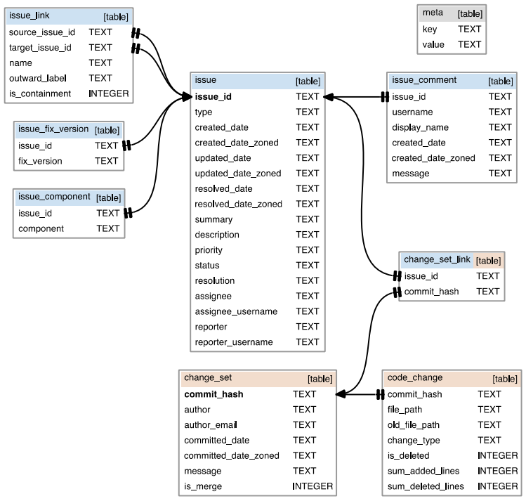

# Table of Contents

* [General info](#1)
* [Overview of the replication package](#7)
* [Data set](#2)
* [Requirements](#3)
* [How to run](#4)
* [How to cite this paper](#5)
* [Reference](#6)

<h2 id="1"> General info </h2>
This repository contains the replication package for paper with the title "Is ABLoTS Replicable and Generalizable for Bug Localization? A Replication Study". This paper is a replication study of the original paper "Analyzing requirements and traceability information to improve bug localization" by Rath et al.[1].


<h2 id="7"> Overview of the replication package </h2>

    /
    .
    |--- ablots/            Implementation of composer component.	
    |--- cache/             Implementation of version history component.
    |--- data/              Example of the data set.
    |--- data_processing/   Read data from SQLite.
    |--- evaluation/        Evaluation metrics, including MAP, MRR, Top K.
    |--- repication/        Preprocessing on extended data set.
    |--- tracescore/        Implementation of TraceScore.
    |--- box.py             Draw box-plot for the paper.
    |--- ks-test.py         ks-test for the paper.

<h2 id="2"> Data set </h2>
    |--- data/errai.sqlite3 is the information for errai project in the data set. For each project, the data set includes information as follows [2]:



<h2 id="3"> Requirements </h2>
python 3.7

<h2 id="4"> How to run </h2>

<h2 id="5"> How to  cite this paper </h2>

```
@INPROCEEDINGS{10173939,
  author={Niu, Feifei and Mayr-Dorn, Christoph and Assunção, Wesley K. G. and Huang, LiGuo and Ge, Jidong and Luo, Bin and Egyed, Alexander},
  booktitle={2023 IEEE/ACM 20th International Conference on Mining Software Repositories (MSR)}, 
  title={The ABLoTS Approach for Bug Localization: is it replicable and generalizable?}, 
  year={2023},
  volume={},
  number={},
  pages={576-587},
  doi={10.1109/MSR59073.2023.00083}}
```

<h2 id="6">Reference</h2>

[1]M. Rath, D. Lo, and P. M ̈ader, “Analyzing requirements and traceability
information to improve bug localization,” in Proceedings of the 15th
International Conference on Mining Software Repositories, 2018, pp.
442–453.

[2]M. Rath and P. M ̈ader, “The seoss 33 dataset—requirements, bug reports,
code history, and trace links for entire projects,” Data in brief, vol. 25,
p. 104005, 2019.
